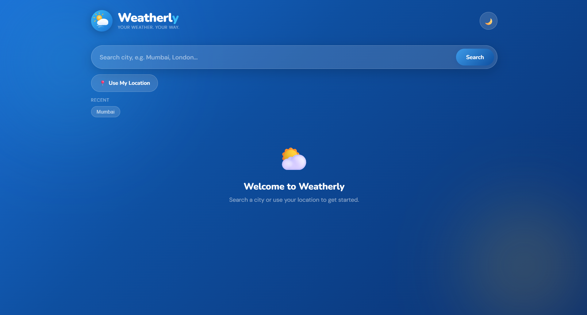
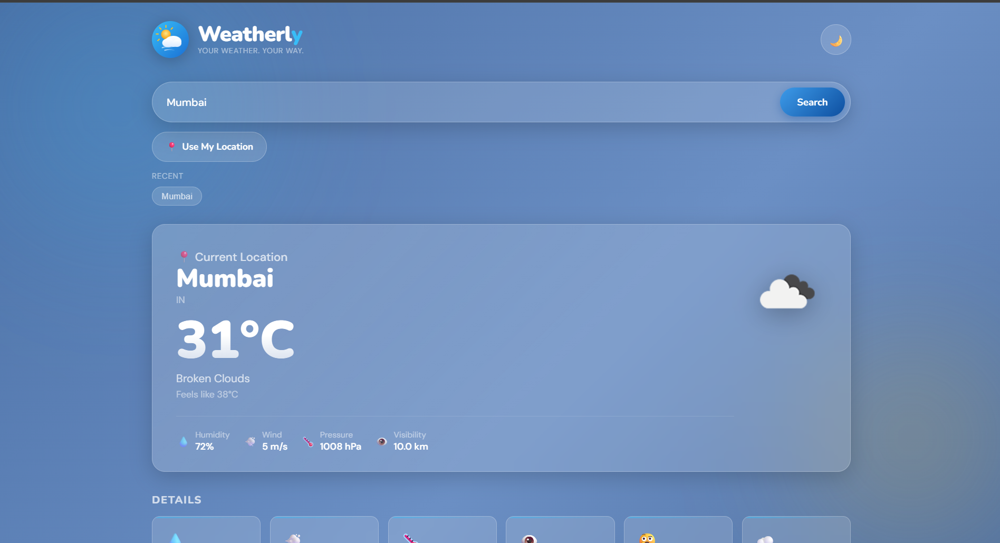
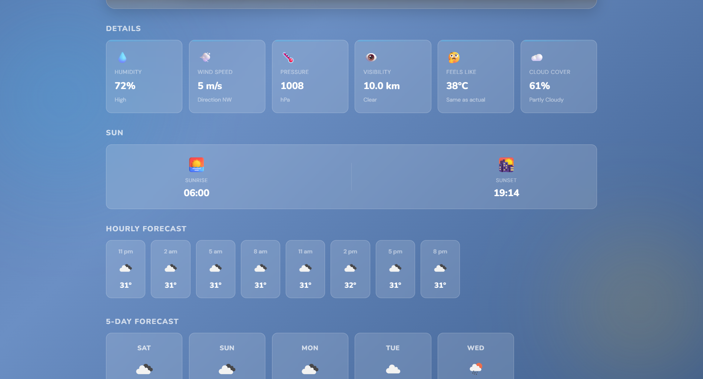
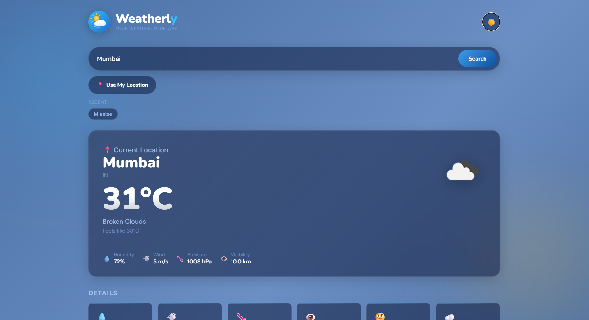
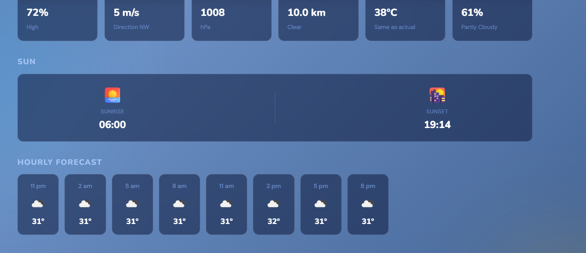

# Weatherly ☁️

A modern weather forecasting web application built using **HTML, CSS, and JavaScript**. Weatherly provides real-time weather information, hourly forecasts, 5-day forecasts, dark mode support, and location-based weather updates through the OpenWeatherMap API.This is vibecoded project.

## 🌟 Features

- 🔍 Search weather by city name
- 📍 Get weather using current location
- 🌡️ Real-time temperature and weather conditions
- ⏰ Hourly weather forecast
- 📅 5-Day weather forecast
- 🌙 Dark Mode support
- 💾 Recent searches saved using Local Storage
- 📱 Fully responsive design
- ✨ Modern glassmorphism UI
- 🎨 Dynamic weather-based backgrounds

## 🛠️ Technologies Used

- HTML5
- CSS3
- JavaScript (ES6)
- OpenWeatherMap API
- Local Storage
- Geolocation API

## 📸 Screenshots

### Home Screen


### Current Weather View


### Forecast Section


### Detailed Weather Information


### Hourly Forecast


## 🚀 How to Run

1. Download or clone the repository.
2. Open `index.html` in your browser.
3. Add your OpenWeatherMap API key in the JavaScript section:

```javascript
const API_KEY = "YOUR_API_KEY";
```

4. Save the file and refresh the page.

## 🎯 Future Improvements

- Weather alerts
- Air Quality Index (AQI)
- Interactive weather maps
- Search suggestions/autocomplete
- Multi-language support

## 👨‍💻 Author

**Siddharth Singh**

Computer Science Student | Aspiring Software Developer

## 🌐 Live Demo

https://siddharth-singh-cs.github.io/Weatherly-v1/

## Note: This is a completely vibe coded project.
